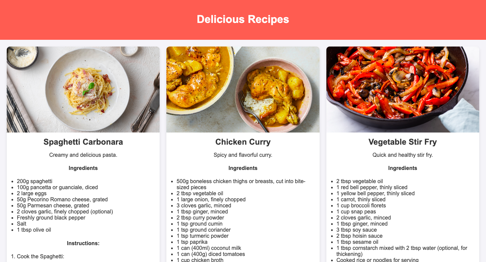
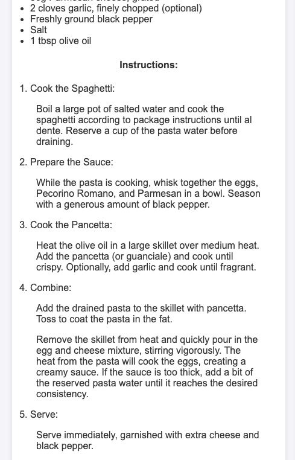

# Odin Recipes

Welcome to **Odin Recipes**! This project is a simple recipe website that showcases three delicious recipes: Spaghetti Carbonara, Chicken Curry, and Vegetable Stir Fry. It features a responsive layout, engaging design, and easy navigation, making it a great starting point for web development and CSS practice.

## Table of Contents

- [Overview](#overview)
- [Features](#features)
- [Screenshots](#screenshots)
- [Technologies Used](#technologies-used)
- [Installation](#installation)
- [Usage](#usage)
- [Contributing](#contributing)
- [License](#license)
- [Acknowledgements](#acknowledgements)

## Overview

This project was built as part of the [Odin Project](https://www.theodinproject.com) curriculum to practice HTML and CSS skills. The website includes three recipe cards for popular dishes, each with a list of ingredients and step-by-step cooking instructions.

## Features

- **Responsive Design:** The layout adjusts to various screen sizes, ensuring a good user experience on both mobile and desktop devices.
- **Recipe Cards:** Each recipe is displayed in a visually appealing card format.
- **Dynamic Favicon:** A round-shaped favicon enhances the site's branding.
- **Hover Effects:** Smooth hover effects for interactivity.

## Screenshots


*Homepage displaying recipe cards.*


*Detailed view of a recipe card.*

## Technologies Used

- **HTML5:** For the structure of the website.
- **CSS3:** For styling and layout, including Flexbox for responsive design.
- **Git:** For version control and collaboration.

## Installation

1. **Clone the repository:**

   ```bash
   git clone https://github.com/yourusername/odin-recipes.git

